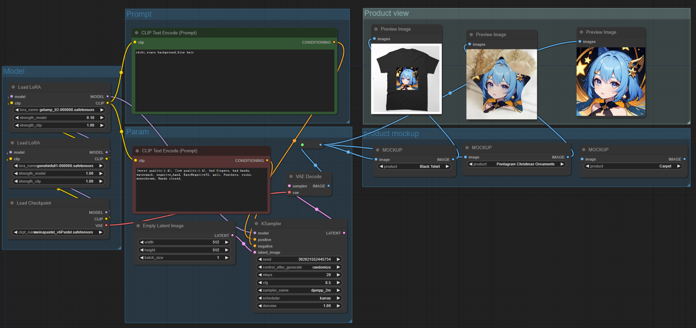

# ComfyUI-yoy
This plugin gives you the ability to generate a real Product rendering, commonly referred to as the mockup.The most important is that
we can provide it for you,cause we have a complete supply chain.You can buy products with your designs or sell them.
We can provide you dropshipping services. 

# Installation
To install, clone this repository into ComfyUI/custom_nodes folder with git clone https://github.com/Continue7777/comfyui-yoy.git and restart ComfyUI.

# Demo workflow
There is a demo workflow in examples that you can download it.Maybe use your own model or lora.
Just add a yoy_nodes/MOCKUP and select a product,then link the output to a previewImage.

# gallery
 

# Todo
+ If you like it,we have nearly 1000+ products to offer.
+ Some workflows for you to try on T-shirts or other products.
+ Provides an invoice that you can buy.
+ Provides an H5 page that you can sell on your social medial.

If you have other ideas please contact us . 

# Product Supply
If you want to buy or sell the product with your design.Please email zhangfanyu@yoycol.com.

